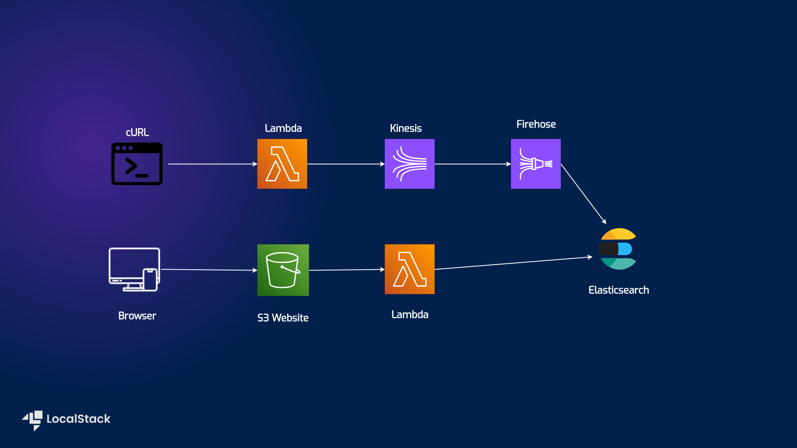
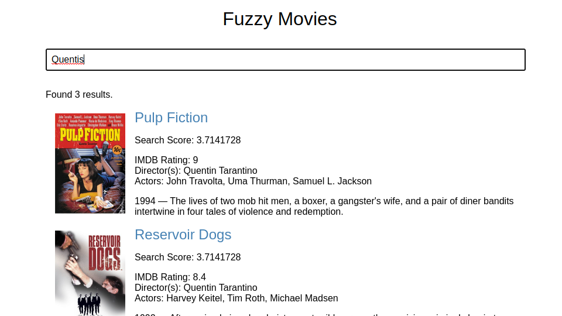

# Fuzzy Movie Search - Search application with Lambda, Kinesis, Firehose, ElasticSearch, S3


| Key          | Value                                                                                 |
| ------------ | ------------------------------------------------------------------------------------- |
| Environment  |              |
| Services     | Lambda, Kinesis, Firehose, ElasticSearch, S3                                            |
| Integrations | Terraform, AWS CLI                                                                      |
| Categories   | Serverless; Event-Driven architecture                                                   |
| Level        | Intermediate                                                                            |
| GitHub       | [Repository link](https://github.com/localstack/fuzzy-movie-search)                 |

## Introduction
This Fuzzy Search application demonstrates how to set up an S3-hosted website that enables you to fuzzy-search a movie database. The sample application implements the following integration among the various AWS services:
- A data ingestion pipeline which allows adding movie data to an ElasticSearch index via:
  - An AWS Lambda function, explosed via a fuction URL.
  - The Lambda function sends the JSON payload to a Kinesis Data Stream.
  - A Kinesis Firehose Delivery Stream forwards the data to an ElasticSearch domain.
- A frontend / website which:
  - Has a simple search interface to search for movies in the database.
  - The HTML page uses a plain JS script to query data using a second Lambda function.
  - This Lambda function performs a fuzzy query on the movie index in the ElasticSearch cluster.

## Architecture Diagram

The following diagram shows the architecture that this sample application builds and deploys:



[S3 Website](https://docs.localstack.cloud/tutorials/s3-static-website-terraform/) that holds the website.
[Lambda] (https://docs.localstack.cloud/user-guide/aws/lambda/) for feeding the Kinesis stream and performing the fuzzy-search.
[Kinesis](https://docs.localstack.cloud/user-guide/aws/kinesis/) for forwarding the data into Elasticsearch.
[Firehose](https://docs.localstack.cloud/user-guide/aws/kinesis-firehose/) for forwarding the data into Elasticsearch.
[Elasticsearch](https://docs.localstack.cloud/user-guide/aws/elasticsearch/) which actually holds the data.

## Prerequisites
- LocalStack Pro with the [`localstack` CLI](https://docs.localstack.cloud/getting-started/installation/#localstack-cli).
- [Terraform](https://docs.localstack.cloud/user-guide/integrations/terraform/) with the [`tflocal`](https://github.com/localstack/terraform-local) installed.
- [AWS CLI](https://docs.localstack.cloud/user-guide/integrations/aws-cli/) with the [`awslocal` wrapper](https://docs.localstack.cloud/user-guide/integrations/aws-cli/#localstack-aws-cli-awslocal).

Start LocalStack Pro with the `LOCALSTACK_API_KEY` pre-configured:

```shell
export LOCALSTACK_API_KEY=<your-api-key>
docker compose up -d
```

## Instructions
You can build and deploy the sample application on LocalStack by running `./run.sh`.
Here are instructions to deploy and test it manually step-by-step.

### Build the application

To build the Terraform application, run the following commands:

```bash
terraform init; terraform plan; terraform apply --auto-approve
```
This will create all ressources specified in `main.tf`. 
This can take can take a couple of minutes.
Once it is done, you will be able to save the following values into variables by executing these commands

```bash
ingest_function_url=$(terraform output --raw ingest_lambda_url)
elasticsearch_endpoint=$(terraform output --raw elasticsearch_endpoint)
```

### Download the dataset

The dataset we will use for this application is a selection of movies and their typical data such as name, author, genre, etc.
Execute the following commands to make it available.

```bash
temp_dir=$(mktemp --directory)
movie_dataset_url="https://docs.aws.amazon.com/opensearch-service/latest/developerguide/samples/sample-movies.zip"
curl -L $movie_dataset_url > $temp_dir/sample-movies.zip
unzip $temp_dir/sample-movies.zip -d $temp_dir/
```

### Pre-processing the data

For the data to properly work for our streaming use case, we need to remove the bulk insert instruction.

```bash
grep -v '^{ "index"' $temp_dir/sample-movies.bulk > $temp_dir/sample-movies-processed.bulk
mv $temp_dir/sample-movies-processed.bulk $temp_dir/sample-movies.bulk
```

### Populating the database

We know populate the database with the actual entries via our lambda function.
Execute the following code to insert the entries line by line.
It will take quite some time to finish

```bash
cat $temp_dir/sample-movies.bulk | while read line
do
   echo -n "."
   echo $line | curl -s -X POST $ingest_function_url \
        -H 'Content-Type: application/json' \
        -d @- > /dev/null
done
```

### Querying the database

Now you can access the website with its entries under http://movie-search.s3-website.localhost.localstack.cloud:4566/ .
If e.g. you search for "Quentis", a misspelling of "Quentin", you should see entries that relate the director "Quentin Tarantino", similar to the following screenshot.




## Known limitations

The localstack logs sometimes show error message in regards to the firehose propagation.
While this might reduce the size of the database to some degree, it is still be sufficient for demonstration purposes.


## Contributing

We appreciate your interest in contributing to our project and are always looking for new ways to improve the developer experience. We welcome feedback, bug reports, and even feature ideas from the community.
Please refer to the [contributing file](CONTRIBUTING.md) for more details on how to get started. 