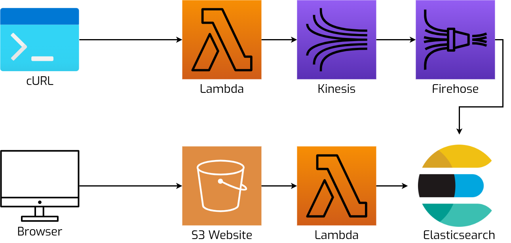

# Fuzzy Movies
## Lambda, Kinesis, Firehose, ElasticSearch, S3


This Hackathon project is an AWS app consisting of:
- A data ingestion pipeline which allows adding movie data to an ElasticSearch index via:
  1. An AWS Lambda function, explosed via a fuction URL.
  2. The Lambda function sends the JSON payload to a Kinesis Data Stream.
  3. A Kinesis Firehose Delivery Stream forwards the data to an ElasticSearch domain.
- A frontend / website which:
  - Has a simple search interface to search for movies in the database.
  - The HTML page uses a vanilla JS script to query data using a second Lambda function.
  - This Lambda function performs a fuzzy query on the movie index in the ElasticSearch cluster.

## System Overview


## Setup
1. Clone this repo and `cd` into its working directory
2. Install the following tools:
  - [Terraform](https://www.terraform.io/downloads) (v1.4.5)
  - [tflocal](https://github.com/localstack/terraform-local)
  - [awslocal](https://github.com/localstack/awscli-local)
3. Start LocalStack in the foreground so you can watch the logs:
   ```
   docker compose up
   ```
4. Open another terminal window and `cd` into the same working directory
5. Create the resource and trigger the invocation of the lambda:
   ```
   ./run.sh
   ```

# TODO:
- This sample does not yet run on AWS
  - Firehose -> ElasticSearch
    - Records are not properly delivered to ElasticSearch yet
  - Search Lambda -> ElasticSearch
    - Lambda needs to sign the HTTP requests to ElasticSearch
- Simplify the S3 website URL in LocalStack
  - We need to use http://movie-search.s3.amazonaws.com:4566/index.html instead of the generated output: http://movie-search.s3-website-eu-west-1.amazonaws.com/
  - It works with http://movie-search.s3-website.localhost.localstack.cloud/
- HTTPS?
  - Due to the function URLs having no proper certificate, we can only use the http version!
  - http://movie-search.s3-website.localhost.localstack.cloud:4566/
